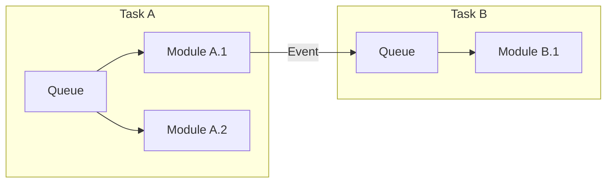
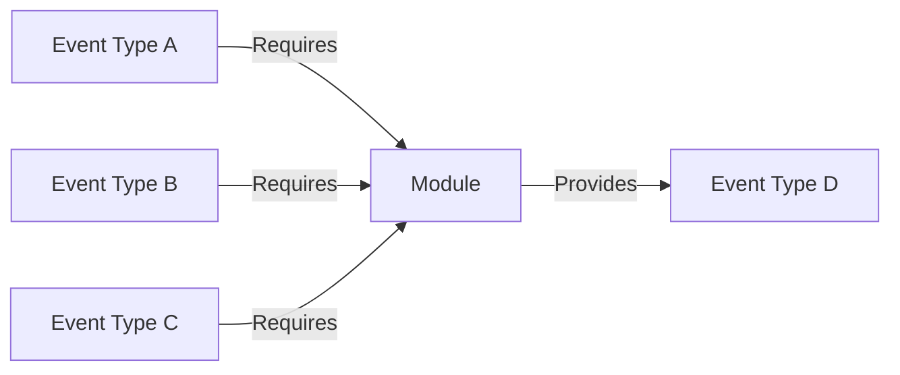
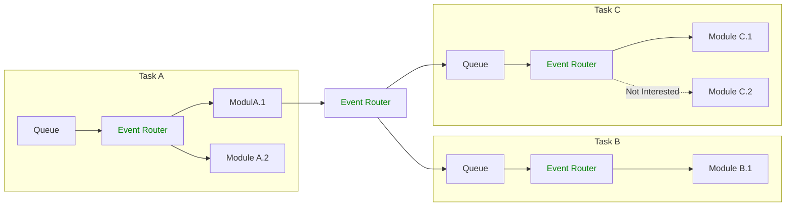

# Event Router

A C library for event-based inter-task communication in [FreeRTOS](https://www.freertos.org/).

# Quickstart

The `example/` application demonstrates how to define events, initialize the Event Router, publish events, and subscribe to them.

Developers who wish to use the Event Router must compile `eventrouter.c` (with a C11-compatible compiler) and add `<repo>/include` to their list of include paths.

# Overview

This document models event-based RTOS applications as collections of Tasks, each of which contain Modules, each of which (may) generate events and post them to Queues. Each Task reads Events from its Queue and delivers them to the Modules it "contains" based on the Event's type.

Ideally, Modules only know about the Events types they publish and the Events types they want to receive; they should know nothing about the modules that consume the data they produce and nothing about the modules that produce what they consume. This results in a loosely-coupled application.

The Event Router achieves this by sitting between Queues and Modules (and between Modules and Queues) to provide a uniform publisher-subscriber framework. When a Module sends an event, the Event Router delivers it to all Modules which subscribe to Events of that type and then returns it to the sending Module.

The Event Router passes events by reference. This means Modules may not modify events after sending them until the Event Router returns them. In this way, the send-deliver-return flow lets Modules perform a primitive form of ownership tracking.
