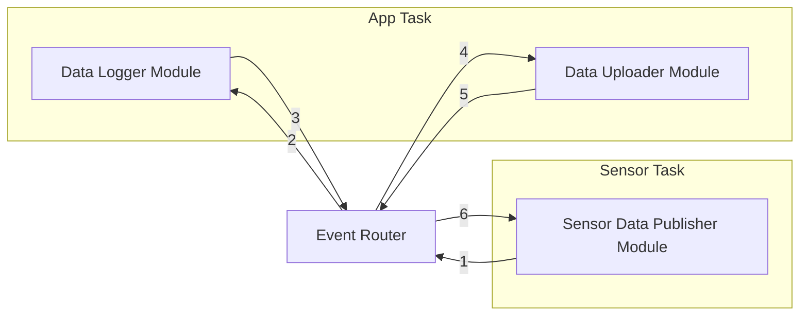

# Overview

This example application defines three modules in two FreeRTOS tasks, where each
task draws from a FreeRTOS queue that passes `ErEvent_t*`s.

The Sensor Data Publisher Module sends an Event of type `ER_EVENT__SENSOR_DATA`
every two seconds. The Data Logger Module and Data Uploader Module subscribe to
`ER_EVENT__SENSOR_DATA` and receive the data that the publisher module sends.
